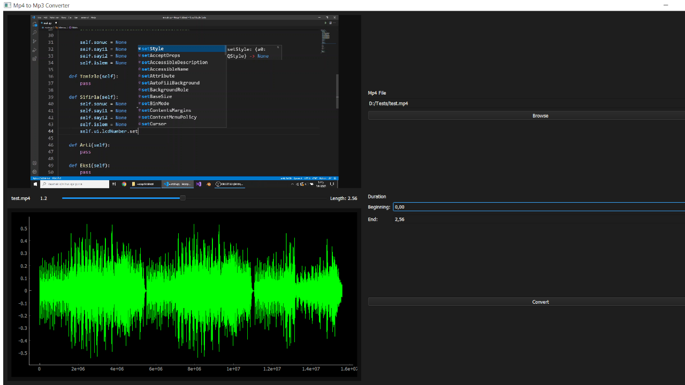

# Mp4-to-Mp3-Converter

[Mp4 to Mp3 Converter]() converts mp4 video files to mp3 audio files



<hr>


## Running the application

1) Clone GitHub repository
2) ```pip install -r requirements.txt```
3) ```python main.py```